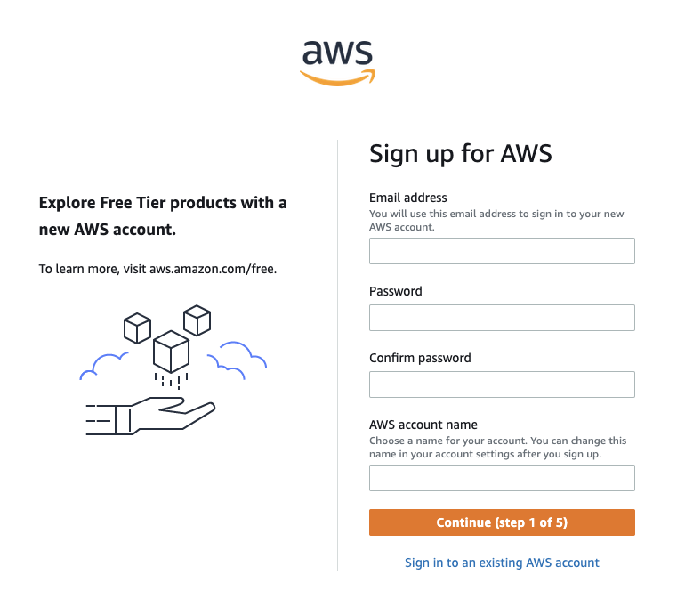
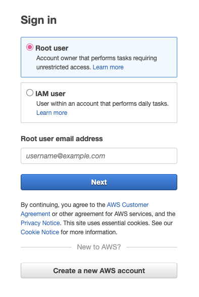
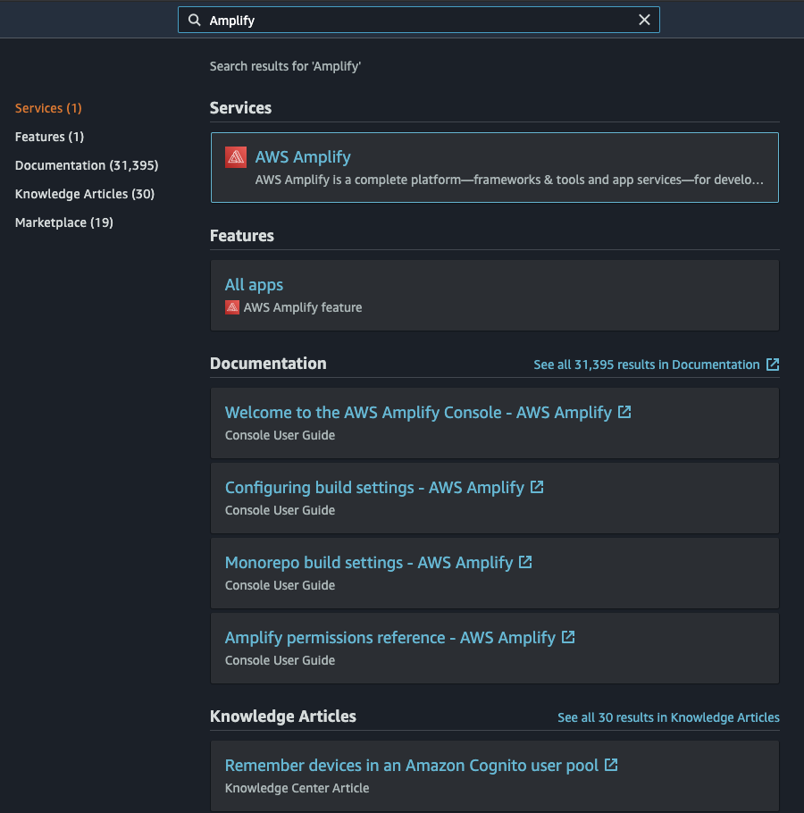
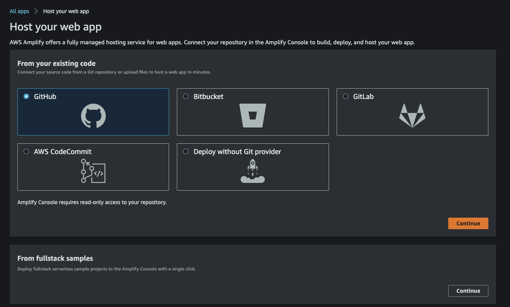
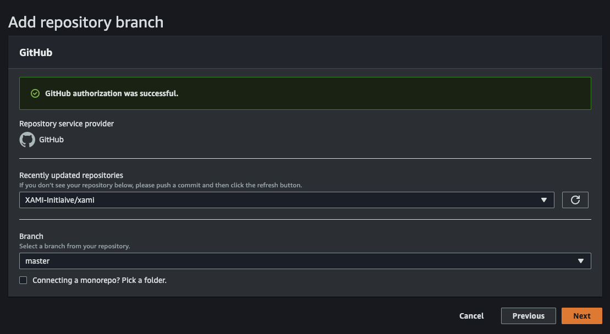
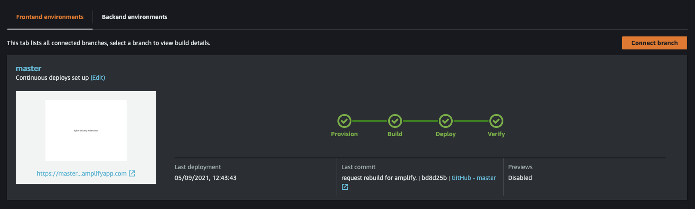

# How to deploy react application to AWS (Amazon Web Service)

1. Create an application if you don't have existing project.

To Create an application, simply: `npx create-react-app my-app`. To do this, it will make a project, called "my-app" in your current path.

2. After having the project, you can push your project to GitHub, which will be used as our codebase to connect AWS.

2. Once have done with GitHub, you will need to prepare an AWS account. If you don't have, you need to register one.

3. After obtaining the AWS account, you need to login as the root user, which will allow you to access AWS Amplify service without any restricition.

4. Search amplify in the header, then get into amplify service.

5. Click the orange button on the right, "New app" >> Host web app. You should be able to see a page like this. Select GitHub as your existing code base then press "Continue". It will redirect you to the GitHub Login Page and ask you the permission to access your reposiotories. Once you login, you should be able to select the repository and branch that containing your React project. Follow the process to the end, it will deploy the React App to AWS. 

6. Before accessing to your website, make sure the deploying process has been done. After the "verify" stage has been ticked. You should be able to see your webstie throguht the web address it provides in the left bottom corner.

